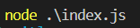
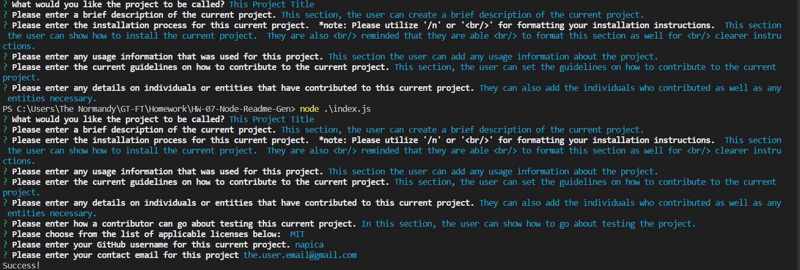
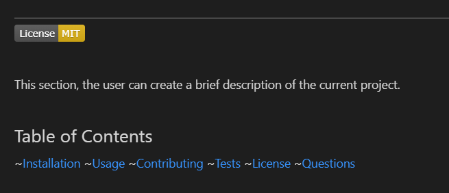

# Read-Gen

  

   
  
  This project is designed to dynamically generate a custom README.md file for a user's project.  With a series of prompts and selections, a user is able to create a README.md file quickly, instead of having to waste time creating and writing one from scratch.

   

## Table of Contents

~[Installation](#installation)
~[Usage](#usage)
~[Contributing](#contributing)
~[Features](#features)
~[Tests](#tests)
~[License](#license)
~[Questions](#questions)

   

## Installation

  

  
  **To edit/use the application, please follow the steps to pull the repository from GitHub through Git Bash and pull the script into VSCode, provided all three items are already installed on a local network.  It also requires Node.JS to be installed on the local network as well.**

Instillation steps are as follows:

1. Access the repository at [Git Hub] https://github.com/Napica/HW-07-Node-Readme-Gen.
2. Click on the code section (in green) and clone the SSH key.
3. Once the SSH key is cloned, open the terminal through Git Bash.
4. Find or create the folder the user wants to work in and enter the following commands the the Git terminal:
   1. git clone [copied link] (_this will allow access the repository to the local computer._)
   2. git pull (_this will pull all the lines of script from the local repository._)
   3. code . (\*This will extract the code and link the paths to VSCode for review/editing/uploading)
5. In the the terminal, please run "npm install" (as the dependencie should be there) to download the modules necessary for this project to work.  
6.  Once the modules are downloaded, please open up the terminal again and run "node ./index.js".  This will initialize the project and send you on your way to generating a readme File. 

Please click on the link below to see a demonstration of the project:

1. https://drive.google.com/file/d/1FVjM93NMVG1F7zarPNxjr71tnMBjafnh/view

   
   
  
  ## Usage 
  
  

  
   
  
 This project is used to generate a read me quickly and efficiently. 
     
     

  ## Contribution 
  
  

  
  #### Contributors 
  
  Currently no specific contributors.  I would, however, like to thank the assisstance of my TA's/Tutors/Classmates for the creation of the project. 
  
   
  
  ## Features
  

  
#### When installed properly,the user can run via the command below:
  
 

 

#### When the command above is ran, the user will be given a series of prompts and choices below.  Please fill out these sections to generate the reademe file. An example is given below.  Once it is generated, "success" will be at the bottom of the command line.

 

#### Once everything is generated, the user will have a readme file that generates an active licensing badge and active links to the sections they added to. 

 

## Tests

  

  
  
  If you would like to go about testing this project, please install the project on a local server for testing.   

   
  
  ## License 
  
  

  
  This application is licensed under MIT

   

## Questions

  

  
  #### If you would like to know more, please contact or see any other projects at [napica](https://github.com/napica)
